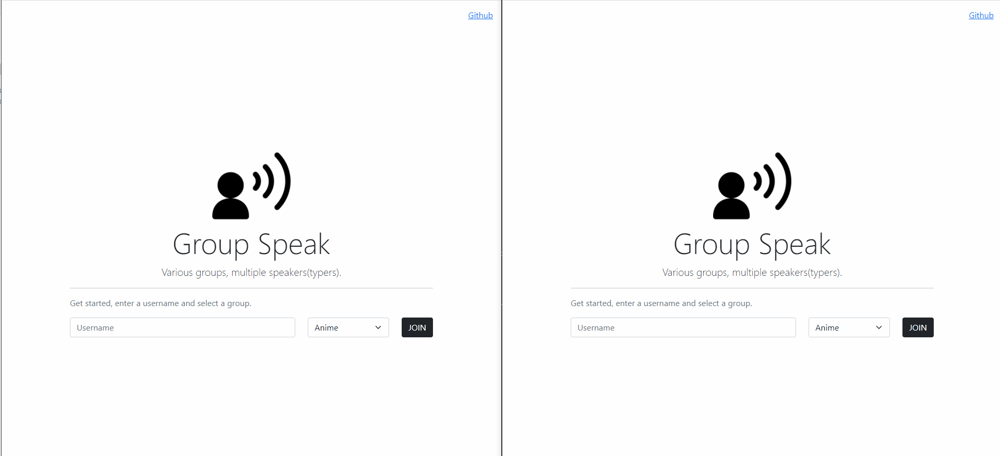

# Group Speak

Group Speak is a George Brown College Full Stack Lab Test 1 Program, developed using Node, Express, MongoDB and Socket IO.

Check it out [Live](https://group-speak.herokuapp.com/)!

<p align="center">
  
</p>

## Installation

Clone the repo and install the dependencies.

```bash
git clone https://github.com/esogelola/Group-Speak.git
cd Group-Speak
```

```bash
npm install
```

## Usage

To start the express server, run the following

```bash
npm run start
```

Open [http://localhost:3000](http://localhost:3000) and take a look around.

## Contributing

Pull requests are welcome. For major changes, please open an issue first to discuss what you would like to change.

Please make sure to update tests as appropriate.

## License

[MIT](https://choosealicense.com/licenses/mit/)
